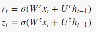
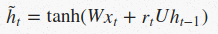
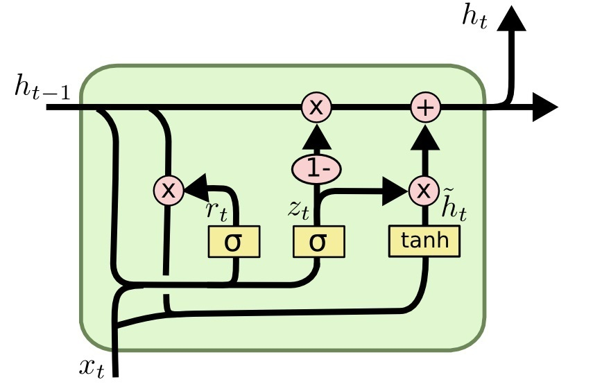

# RNN-LSTM-GRU 笔记
Author: qianS

Email: qiangezaici@outlook.com

date: 2020 - 11 - 3

---

### 目的

深挖GRU模型原理, 实现模型底层自定义化. 为GRU时间序列预测模型添加变量影响.

### 计划添加进GRU模型的权重(日销量的影响因素)

- 商品销售单价
- 是否节假日(后期可分多级, 目前计划[0, 1])
  - 0 : 非节假日
  - 1 : 节假日
- 天气(后期可分多级, 目前计划[-1, 0])
  - -1 : 雨雪
  -  0  : 阴晴

### LSTM理解(Long Short Term Memory)

##### 基本模块

LSTM中每个循环单元包含四个神经网络层, 并且他们都以非常简单的方式起作用.

##### 核心思想

LSTM的关键之处在于cell的状态, 也就是贯穿顶部的水平线. cell的状态像是一条传送带, 他贯穿整条链, 其中只发生一些小的线性作用. 信息流经过这条线而不改变是非常容易的.

但是LSTM也又能力移除或增加信息到cell状态中, 由被称为门的结构精细控制. 门是一种让信息可选择的通过的方法. 他们由一个sigmod神经网络层和一个点乘操作组成. 

sigmod层输出[0, 1]区间内的数，描述了每个部分中应该通过的比例。输出0意味着“什么都不能通过”，而输出1意味着“让所有东西通过”。一个LSTM有四个这样的门，以保护和控制cell的状态。

##### 深入理解LSTM

- 遗忘门

  LSTM中的第一步是决定我们从细胞状态中丢弃什么信息. 这个决定通过 '遗忘门'完成. 该门会读取 h_(t-1) 和 x_t, 输出一个0到1之间的数值给每个在细胞状态 C__(t-1)中的数字,  1表示“完全保留”，0 表示“完全舍弃”

  

  > 其中h_(t−1)表示的是上一个cell的输出，x_t表示的是当前细胞的输入。σ表示sigmod函数。

- 输入门

  下一步是决定让多少新的信息加入到cell状态中来. 实现这个需求需要两个步骤: 

  - input_gate_layer层

    > 一个sigmod层, 决定哪些信息需要更新

  - tanh层

    > 生成一个向量, 也就是备选的用来更新的内容

  

  现在是更新旧细胞状态的时间了, C_(t-1)

  

- 输出门

  最终, 我们需要确定输出什么值. 这个输出将会基于我们的细胞状态, 但是也是一个过滤后的版本. 首先, 我们运行一个sigmod层来确定细胞状态和哪个部分将输出出去. 接着, 我们把细胞状态通过tanh进行处理(得到 -1 到 1 之间的值)并将他和sigmod门的输出相乘, 最终我们仅仅会输出我们确定输出的那部分

  

- 总结

  

### GRU理解(Gated Recurrent Unit)

##### 变化

它组合了遗忘门和输入门到一个单独的“更新门”中. 它也合并了cell state和hidden state，并且做了一些其他的改变. 结果模型比标准LSTM模型更简单. 

首先介绍GRU的两个门，分别是`reset gate` ![[公式]](https://www.zhihu.com/equation?tex=r_t) 和`update gate` ![[公式]](https://www.zhihu.com/equation?tex=z_t) ，计算方法和LSTM中门的计算方法一致：

然后是计算候选隐藏层（candidate hidden layer） ![[公式]](https://www.zhihu.com/equation?tex=%5Ctilde%7Bh%7D_t) ，这个候选隐藏层 和LSTM中的 ![[公式]](https://www.zhihu.com/equation?tex=%5Ctilde%7Bc%7D_t) 是类似，可以看成是当前时刻的新信息，其中 ![[公式]](https://www.zhihu.com/equation?tex=r_t) 用来控制需要 保留多少之前的记忆，比如如果 ![[公式]](https://www.zhihu.com/equation?tex=r_t) 为0，那么 ![[公式]](https://www.zhihu.com/equation?tex=%5Ctilde%7Bh%7D_t) 只包含当前词的信息：

最后 ![[公式]](https://www.zhihu.com/equation?tex=z_t) 控制需要从前一时刻的隐藏层 ![[公式]](https://www.zhihu.com/equation?tex=h_%7Bt%E2%88%921%7D) 中遗忘多少信息，需要加入多少当前 时刻的隐藏层信息 ![[公式]](https://www.zhihu.com/equation?tex=%5Ctilde%7Bh%7D_t) ，最后得到 ![[公式]](https://www.zhihu.com/equation?tex=h_t) ，直接得到最后输出的隐藏层信息， 需要注意这里与LSTM的区别是GRU中没有output gate：

> 一般来说那些具有短距离依赖的单元`reset gate`比较活跃（如果 ![[公式]](https://www.zhihu.com/equation?tex=r_t) 为1，而 ![[公式]](https://www.zhihu.com/equation?tex=z_t) 为0 那么相当于变成了一个标准的RNN，能处理短距离依赖），具有长距离依赖的单元`update gate`比较活跃。

❗知识点补充：

- return_sequences=True

  所有时间步都输出ht

- return_sequences=False

  仅有最后的时间步输出ht(默认)

- 一般最后一层用False，中间层用True

### Sell_GRU模型设计

##### 模型结构

##### 变量及公式定义

- 输入模型的数据 
  > $$
  > sell\_amount=[x_1,x_2,...,x_n,x_p]
  > $$

  - x1至xn为前一段时间的数据
		> $$
		> x_t=[s,hd,w]
		> $$

  	- s: sell_amount
  	- hd: is_holiday
  	- w: weather

	- xp为被预测日的数据 
	
		> $$
		> x_{p}=[ht,hd_p,wp]
		> $$

    - ht: 上层GRU_CELL的输出
    - hdp: is predict day holiday
    - wp: weather on predict day
  
- Sell_GRU_Cell

  

  - $$
    z_t=	\delta(W_{zs}X_t[0]\ +\ W_{zh}X_t[1]\ +\ W_{zw}X_t[2]\ +\ U_zh_{t-1})
    $$

  - $$
    r_t=\delta(W_{rs}X_t[0]\ +\ W_{rh}X_t[1]\ +\ W_{rw}X_t[2]\ +\ U_rh_{t-1})
    $$

  - $$
    \hat h=tanh(W_{s}X_t[0]\ +\ W_{h}X_t[1]\ +\ W_{w}X_t[2]\ +\ r_tUh_{t-1})
    $$

  - $$
    h_t=(1-z_t)\ast h_{t-1} + z_t \ast \hat h_t
    $$

  