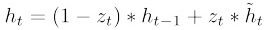

# Sell_GRU 设计
Author: qianS

Email: qiangezaici@outlook.com

date: 2020 - 11 - 3

---

### 目的

深挖GRU模型原理, 实现模型底层自定义化. 为GRU时间序列预测模型添加变量影响.

### 计划添加进GRU模型的权重(日销量的影响因素)

- 商品销售单价
- 是否节假日(后期可分多级, 目前计划[0, 1])
  - 0 : 非节假日
  - 1 : 节假日
- 天气(后期可分多级, 目前计划[-1, 0])
  - -1 : 雨雪
  -  0  : 阴晴

### LSTM理解(Long Short Term Memory)

##### 基本模块


LSTM中每个循环单元包含四个神经网络层, 并且他们都以非常简单的方式起作用.

##### 核心思想


LSTM的关键之处在于cell的状态, 也就是贯穿顶部的水平线. cell的状态像是一条传送带, 他贯穿整条链, 其中只发生一些小的线性作用. 信息流经过这条线而不改变是非常容易的.

但是LSTM也又能力移除或增加信息到cell状态中, 由被称为门的结构精细控制. 门是一种让信息可选择的通过的方法. 他们由一个sigmod神经网络层和一个点乘操作组成. 

sigmod层输出[0, 1]区间内的数，描述了每个部分中应该通过的比例。输出0意味着“什么都不能通过”，而输出1意味着“让所有东西通过”。一个LSTM有四个这样的门，以保护和控制cell的状态。

##### 深入理解LSTM

- 遗忘门

  LSTM中的第一步是决定我们从细胞状态中丢弃什么信息. 这个决定通过 '遗忘门'完成. 该门会读取 h_(t-1) 和 x_t, 输出一个0到1之间的数值给每个在细胞状态 C__(t-1)中的数字,  1表示“完全保留”，0 表示“完全舍弃”

  

  > 其中h_(t−1)表示的是上一个cell的输出，x_t表示的是当前细胞的输入。σ表示sigmod函数。

- 输入门

  下一步是决定让多少新的信息加入到cell状态中来. 实现这个需求需要两个步骤: 

  - input_gate_layer层

    > 一个sigmod层, 决定哪些信息需要更新

  - tanh层

    > 生成一个向量, 也就是备选的用来更新的内容

  

  现在是更新旧细胞状态的时间了, C_(t-1)

  

- 输出门

  最终, 我们需要确定输出什么值. 这个输出将会基于我们的细胞状态, 但是也是一个过滤后的版本. 首先, 我们运行一个sigmod层来确定细胞状态和哪个部分将输出出去. 接着, 我们把细胞状态通过tanh进行处理(得到 -1 到 1 之间的值)并将他和sigmod门的输出相乘, 最终我们仅仅会输出我们确定输出的那部分

  

- 总结

  

### GRU理解(Gated Recurrent Unit)

##### 变化

它组合了遗忘门和输入门到一个单独的“更新门”中. 它也合并了cell state和hidden state，并且做了一些其他的改变. 结果模型比标准LSTM模型更简单. 


首先介绍GRU的两个门，分别是`reset gate` ![[公式]](https://www.zhihu.com/equation?tex=r_t) 和`update gate` ![[公式]](https://www.zhihu.com/equation?tex=z_t) ，计算方法和LSTM中门的计算方法一致：


然后是计算候选隐藏层（candidate hidden layer） ![[公式]](https://www.zhihu.com/equation?tex=%5Ctilde%7Bh%7D_t) ，这个候选隐藏层 和LSTM中的 ![[公式]](https://www.zhihu.com/equation?tex=%5Ctilde%7Bc%7D_t) 是类似，可以看成是当前时刻的新信息，其中 ![[公式]](https://www.zhihu.com/equation?tex=r_t) 用来控制需要 保留多少之前的记忆，比如如果 ![[公式]](https://www.zhihu.com/equation?tex=r_t) 为0，那么 ![[公式]](https://www.zhihu.com/equation?tex=%5Ctilde%7Bh%7D_t) 只包含当前词的信息：


最后 ![[公式]](https://www.zhihu.com/equation?tex=z_t) 控制需要从前一时刻的隐藏层 ![[公式]](https://www.zhihu.com/equation?tex=h_%7Bt%E2%88%921%7D) 中遗忘多少信息，需要加入多少当前 时刻的隐藏层信息 ![[公式]](https://www.zhihu.com/equation?tex=%5Ctilde%7Bh%7D_t) ，最后得到 ![[公式]](https://www.zhihu.com/equation?tex=h_t) ，直接得到最后输出的隐藏层信息， 需要注意这里与LSTM的区别是GRU中没有output gate：



> 一般来说那些具有短距离依赖的单元`reset gate`比较活跃（如果 ![[公式]](https://www.zhihu.com/equation?tex=r_t) 为1，而 ![[公式]](https://www.zhihu.com/equation?tex=z_t) 为0 那么相当于变成了一个标准的RNN，能处理短距离依赖），具有长距离依赖的单元`update gate`比较活跃。

❗知识点补充：

- return_sequences=True

  所有时间步都输出ht

- return_sequences=False

  仅有最后的时间步输出ht(默认)

- 一般最后一层用False，中间层用True

### Sell_GRU模型设计

##### 模型结构


##### 变量及公式定义

- 输入模型的数据 
  > $$
  > sell\_amount=[x_1,x_2,...,x_n,x_p]
  > $$

  - x1至xn为前一段时间的数据
		> $$
		> x_t=[s,hd,w]
		> $$

  	- s: sell_amount
  	- hd: is_holiday
  	- w: weather

	- xp为被预测日的数据 
	
		> $$
		> x_{p}=[ht,hd_p,wp]
		> $$

    - ht: 上层GRU_CELL的输出
    - hdp: is predict day holiday
    - wp: weather on predict day
  
- Sell_GRU_Cell

  

  - $$
    z_t=	\delta(W_{zs}X_t[0]\ +\ W_{zh}X_t[1]\ +\ W_{zw}X_t[2]\ +\ U_zh_{t-1})
    $$

  - $$
    r_t=\delta(W_{rs}X_t[0]\ +\ W_{rh}X_t[1]\ +\ W_{rw}X_t[2]\ +\ U_rh_{t-1})
    $$

  - $$
    \hat h=tanh(W_{s}X_t[0]\ +\ W_{h}X_t[1]\ +\ W_{w}X_t[2]\ +\ r_tUh_{t-1})
    $$

  - $$
    h_t=(1-z_t)\ast h_{t-1} + z_t \ast \hat h_t
    $$


### 代码实现

#### RNNCell层使用方法

在TensorFlow 中，可以通过**layers.SimpleRNNCell** 来完成𝜎(𝑾x h _{xh}*x**h* 𝒙𝑡 + 𝑾 x𝑡−1 + 𝒃)计算。需要注意的是，在TensorFlow 中，**RNN 表示通用意义上的循环神经网络**，对于我们目前介绍的基础循环神经网络，它一般叫做SimpleRNN。**SimpleRNN 与SimpleRNNCell 的区别在于，带Cell 的层仅仅是完成了一个时间戳的前向运算**，不带Cell 的层一般是基于Cell 层实现的，它在内部已经完成了多个时间戳的循环运算，因此使用起来更为方便快捷。

##### SimpleRNNCell

以某输入特征长度𝑛 = 4，Cell 状态向量特征长度ℎ = 3为例，首先我们新建一个SimpleRNNCell，不需要指定序列长度𝑠，代码如下：

```python
In[3]
cell = layers.SimpleRNNCell(3) # 创建RNN Cell,内存向量长度为3
cell.build(input_shape=(None,4)) # 打印特征长度n=4
cell.trainable_variables # 打印wxh,whh,b向量
Out[3]:
[<tf.Variable 'kernel:0' shape=(4, 3) dtype=float32, numpy=…>,
<tf.Variable 'recurrent_kernel:0' shape=(3, 3) dtype=float32, numpy=…>,
<tf.Variable 'bias:0' shape=(3,) dtype=float32, numpy=array([0., 0., 0.],
dtype=float32)>]
123456789
```

可以看到，SimpleRNNCell 内部维护了3 个张量，kernel 变量即𝑾x h _{xh}*x**h* 张量，recurrent_kernel变量即𝑾h h _{hh}*h**h* 张量，bias 变量即偏置𝒃向量。但是RNN 的Memory 向量 h并不由SimpleRNNCell 维护，需要用户自行初始化向量 𝟎并记录每个时间戳上的 𝒕。通过调用Cell 实例即可完成前向运算：

对于 SimpleRNNCell 来说，𝒐𝑡 = 𝑡，并没有经过额外的线性层转换，是同一个对象；[ h𝑡 ]通过一个List 包裹起来，这么设置是为了与LSTM、GRU 等RNN 变种格式统一。在循环神经网络的初始化阶段，状态向量 h𝟎一般初始化为全0 向量，例如：

```python
In[4]
# 初始化状态向量,用列表包裹,统一格式
h0 = [tf.zeros([4,64])]
x = tf.random.normal([4,80,100]) # 生成输入张量,4个80单词的句子
xt = x[:,0,:] # 所有句子的第一个单词
# 构造输入特征n=100,序列长度s=80,状态长度为64的Cell
cell = layers.SimpleRNNCell(64)
out,h1 = cell(xt,h0) # 前向计算
print(out.shape,h1[0].shape)
Out[4]: (4, 64) (4, 64)
12345678910
```

可以看到经过一个时间戳的计算后，输出和状态张量的shape 都为[𝑏, ℎ]，打印出这两者的
id 如下：

```python
In [5]:print(id(out), id(h1[0]))
Out[5]:2154936585256 2154936585256
12
```

两者id 一致，即状态向量直接作为输出向量。对于长度为𝑠的训练来说，需要循环通过Cell 类𝑠次才算完成一次网络层的前向运算。例如：

```python
h = h0 # h 保存每个时间戳上的状态向量列表
# 在序列长度的维度解开输入，得到xt:[b,n]
for xt in tf.unstack(x, axis=1):
	out, h = cell(xt, h) # 前向计算,out 和h 均被覆盖
# 最终输出可以聚合每个时间戳上的输出，也可以只取最后时间戳的输出
out = out
123456
```

**最后一个时间戳的输出变量out 将作为网络的最终输出**。实际上，也可以将**每个时间戳上
的输出保存，然后求和或者均值，将其作为网络的最终输出**。

##### 多层SimpleRNNCell 网络

和卷积神经网络一样，**循环神经网络虽然在时间轴上面展开了多次，但只能算一个网络层**。通过在深度方向堆叠多个Cell 类来实现深层卷积神经网络一样的效果，大大的提升网络的表达能力。但是和卷积神经网络动辄几十、上百的深度层数来比，循环神经网络**很容易出现梯度弥散和梯度爆炸到现象**，深层的循环神经网络训练起来非常困难，**目前常见的循环神经网络模型层数一般控制在十层以内**。

```python
x = tf.rando.normal([4,80,100])
xt = x[:,0,:] # 取第一个时间戳的输入x0
# 构建2个Cell,先cell0,后cell1,内存状态向量长度都为64
cell0 = layers.SimpleRNNCell(64)
cell1 = layers.SimpleRNNCell(64)
ho = [tf.zeros([4,64])] # cell0 的初始状态向量
h1 = [tf.zeros([4,64])] # cell1的 初始状态向量
1234567
```

在时间轴上面循环计算多次来实现整个网络的前向运算，每个时间戳上的输入xt 首先通过第一层，得到输出out0，再通过第二层，得到输出out1，代码如下：

```python
for xt in tf.unstack(x,axis=1):
	# xt作为输入,输出out0
	out0,h0 = cell0(xt,h0)
	# 上一个cell的输出out0作为本cell的输入
	out1,h1 = cell1(out0,h1)
12345
```

上述方式先完成一个时间戳上的输入在所有层上的传播,再循环计算完所有时间戳上的输入

实际上，也可以先完成输入在第一层上所有时间戳的计算，并保存第一层在所有时间
戳上的输出列表，再计算第二层、第三层等的传播。代码如下：

```python
# 保存上一层的所有时间戳上面的输出
middle_sequences
# 计算第一层的所有时间戳上面的输出,并保存
for xt in tf.unstack(x,axis=1):
	out0,h0 = cell0(xt,h0)
	middle_sequences.append(out0)
# 计算第二层的所有时间戳上的输出
# 如果不上末层,需要保存所有时间戳上面的输出
for xt in middle_sequences:
	out1,h1 = cell1(xt,h1)
12345678910
```

使用这种方式的话，我们需要一个额外的List 来保存上一层所有时间戳上面的状态信息：**middle_sequences.append(out0)**。这两种方式效果相同，可以根据个人喜好选择编程风格。需要注意的是，**循环神经网络的每一层、每一个时间戳上面均有状态输出，那么对于后续任务来说，我们应该收集哪些状态输出最有效呢？**一般来说，**最末层Cell 的状态有可能保存了高层的全局语义特征，因此一般使用最末层的输出作为后续任务网络的输入**。更特别地，**每层最后一个时间戳上的状态输出包含了整个序列的全局信息**，如果只希望选用一个状态变量来完成后续任务，比如情感分类问题，一般选用最末层、最末时间戳的状态输出最为合适。
